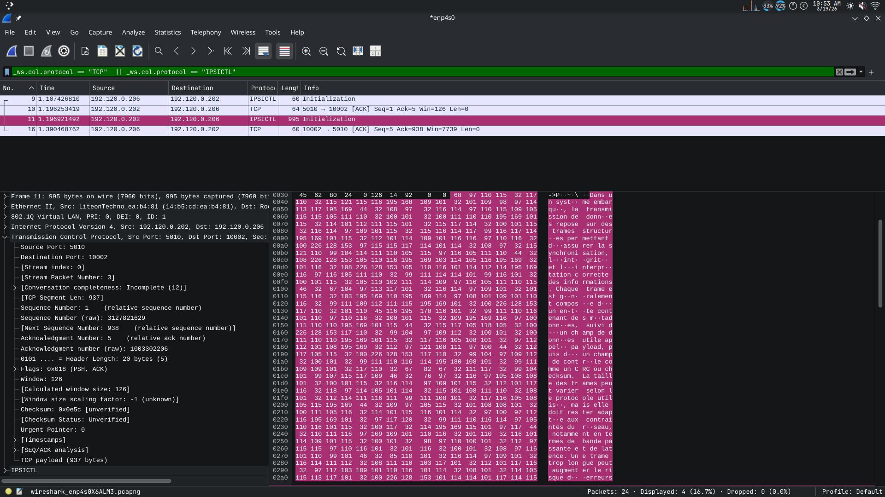

# Analyse des échanges de trames TCP entre Arduino Uno_Q et Rockwell 1769-L36ERMS

## Ordre des tests :
 - Une grosse trame envoyée Arduino → Rockwell
 - Une grosse trame envoyée Rockwell → Arduino
 - Plusieurs trames envoyées Arduino → Rockwell
 - Plusieurs trames envoyées Rockwell → Arduino

---

## Une grosse trame envoyée Arduino → Rockwell 

### Séquence observée avec Wireshark :

    PLC → PC : "semp" (4 bytes)
    PC → PLC : ACK
    PC → PLC : gros message (937 bytes)
    PLC → PC : ACK



### Problème rencontré :

Côté Rockwell, la taille maximale lisible est de **484 bytes**.

- Même si le PLC envoie un ACK, il est impossible de lire toute la trame en une seule fois  
- Les données sont bien présentes dans le buffer TCP  
- Mais chaque lecture est limitée à 484 bytes  


### Solution apportée :

- Ajouter un contrôle du buffer  
- Lire en plusieurs fois  
- Stocker les morceaux dans un buffer plus grand  
- Reconstituer la trame complète  

---

## Une grosse trame envoyée Rockwell → Arduino

Pour ce test, envoi de la taille maximale du buffer (460 bytes utiles, soit 460 - 16)

### Séquence observée :

    PLC → PC : "hello + padding"
    PC → PLC : ACK

    PC → PLC : "444 octets"
    PLC → PC : ACK

    PC → PLC : renvoie ENCORE "444 octets"
    PLC → PC : duplicate ACK


### Observation :

- Arduino reçoit correctement les 444 octets  
- Une duplication de trame est visible  


### Interprétation :

- La trame dupliquée semble provenir du programme  
- Aucun test supplémentaire n’a été réalisé pour confirmer  

---

## Plusieurs trames envoyées Arduino → Rockwell

Test réalisé avec 200 envois successifs :

```C
if reponse is not None:
    for i in range(200):
        a = f"{i}"
        sclient.sendall(a.encode())
````

### Séquence observée :

    Rockwell → Python : envoi 444 octets ("hello" + padding)
    Python   → Rockwell : ACK

    Python   → Rockwell : "0" (1 octet)
    Rockwell → Python   : ACK

    Python   → Rockwell : envoi 489 octets (gros texte)
    Rockwell → Python   : ACK

    Python   → Rockwell : renvoi du même bloc 489 octets
    Rockwell → Python   : duplicate ACK


### Problème :

* Côté Rockwell, seule la valeur `"0"` est lue
* Les autres données restent dans le buffer


### Solution mise en place :

* Lire en boucle tant que `buffer.length != 0`
* Accumuler les données dans un buffer secondaire


### Résultat attendu :

* Lorsque `buffer.length == 0`, toutes les données ont été lues
* Mise en place d’un double buffer :

  * buffer de lecture (484 bytes max)
  * buffer de stockage (taille variable)

---

## Plusieurs trames envoyées Rockwell → Arduino

### Logique mise en place côté PLC :


### Séquence observée :

    Rockwell → Arduino : envoi petit message (1 octet)
    Arduino  → Rockwell : ACK

    Arduino  → Rockwell : envoi petit texte (~8 octets)
    Rockwell → Arduino : ACK

    Arduino  → Rockwell : envoi gros bloc (~489 octets)
    Rockwell → Arduino : ACK

    Arduino  → Rockwell : renvoi du même bloc 489 octets
    Rockwell → Arduino : duplicate ACK


### Observation côté Arduino :

* Tous les paquets sont reçus correctement
* Les données arrivent séparément


### Problème côté Rockwell :

* Lecture retourne `0 bytes` → timeout
* Le buffer semble vide


### Vérification :

* Une lecture manuelle récupère les données restantes
* Le buffer n’était donc pas réellement vide


