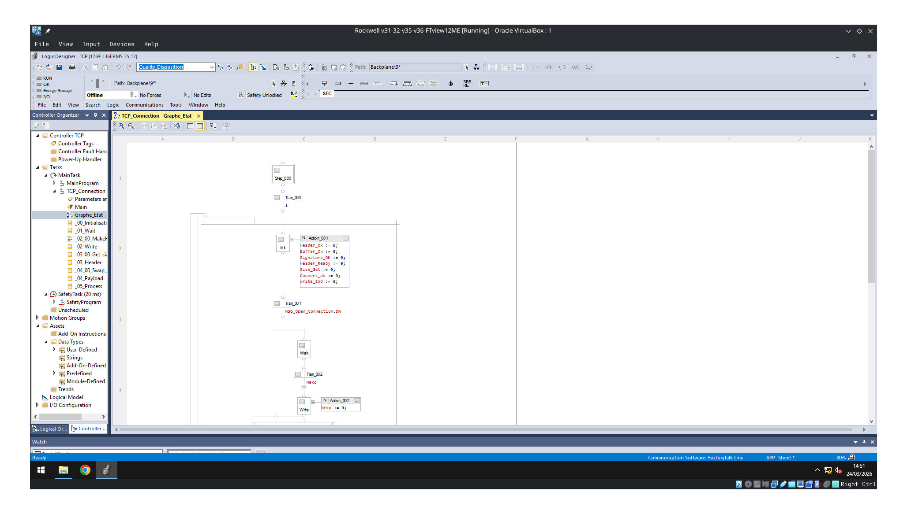
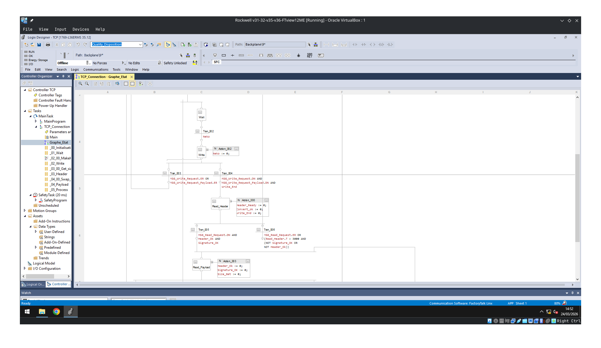
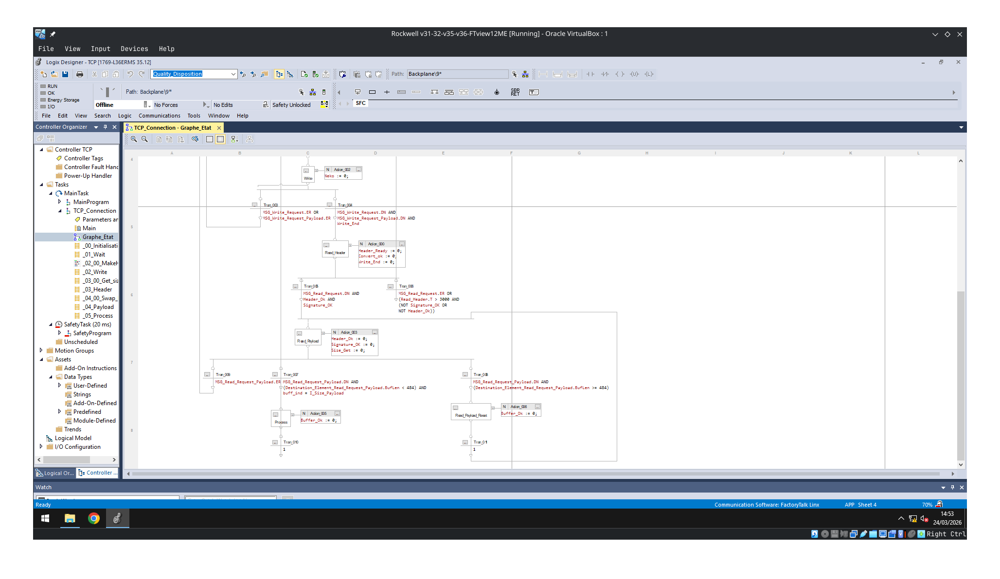
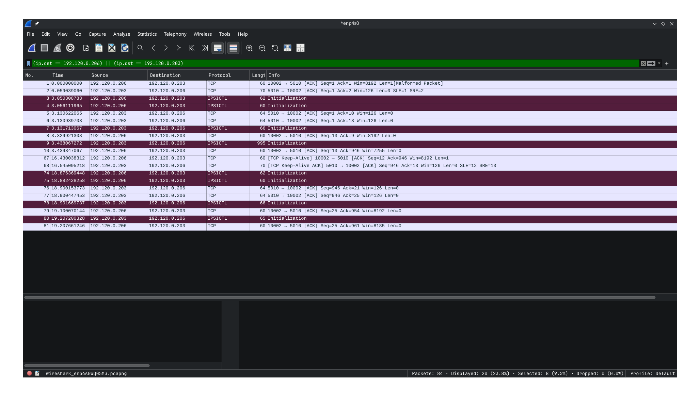

# Code Explanation

## System Architecture

The system is controlled by a Sequential Function Chart (SFC) structured in multiple stages.

The following diagrams illustrate the global behavior and state transitions:





The SFC organizes the execution flow into clearly defined states, handling:
- Initialization of the communication
- Connection management (client/server)
- Data transmission
- Data reception and processing

Each state is responsible for a specific part of the communication lifecycle, ensuring deterministic and cyclic execution.

---

## Communication Protocol

The system follows the protocol defined in:

```

Protocole/Protocole.md

```

The transmission is performed in two distinct steps:

### 1. Header Transmission

A header is sent first, containing:
- **Signature**: used to validate the integrity and origin of the message
- **Payload Size**: indicates the size of the incoming data

This step allows the receiver to prepare for correct data acquisition.

### 2. Payload Transmission

Once the header is sent, the payload is transmitted separately.

This separation ensures:
- Better control of buffer handling
- Compatibility with systems having limited read sizes (e.g., PLC constraints)

---

## Reception and Decoding

On the receiving side, the process is as follows:

1. Read and decode the header
2. Verify:
   - The **signature** is valid
   - The **payload size** is consistent
3. If valid, read the payload according to the specified size
4. Process the received data

This validation step prevents:
- Corrupted data interpretation
- Misaligned buffer reads
- Invalid communication states

---

## Network Trace Analysis

The following capture shows an example of the communication observed on the network:



The exchange highlights:
- Separation between header and payload
- Proper acknowledgment behavior
- Correct sequencing of messages

This confirms that the protocol is correctly implemented and respected on both sides.
