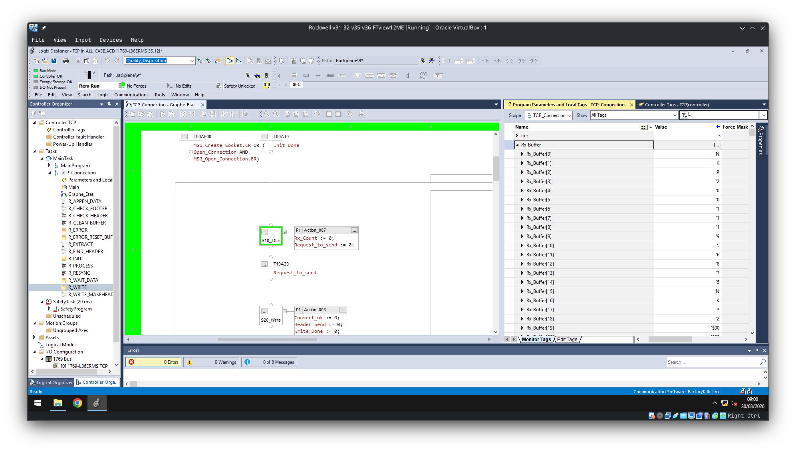
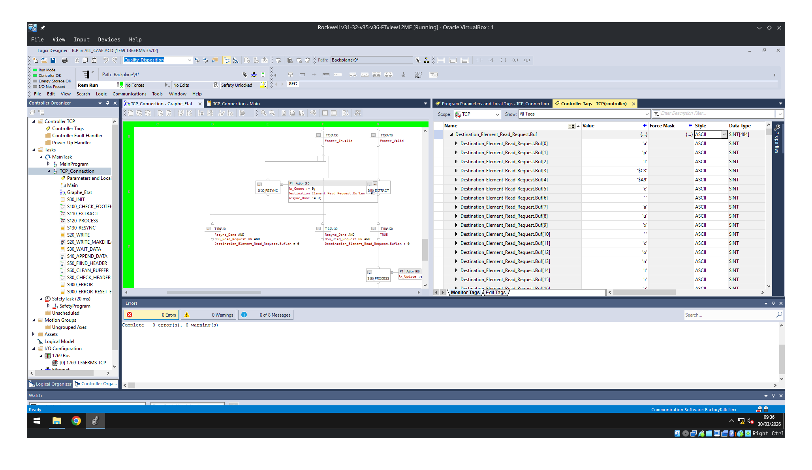
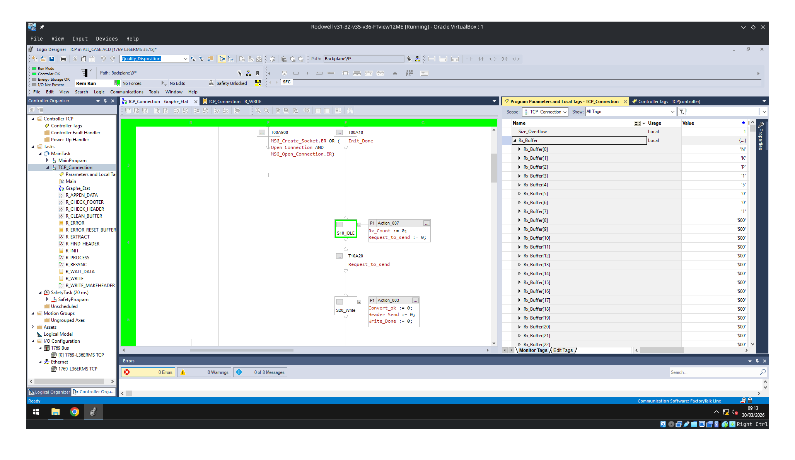
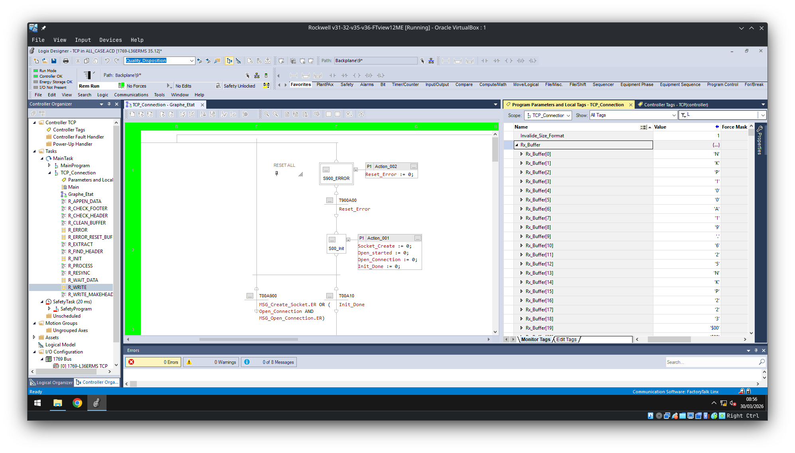
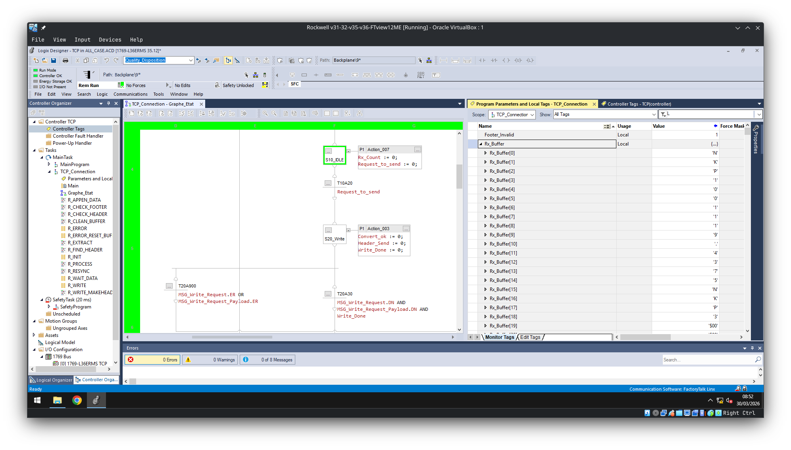
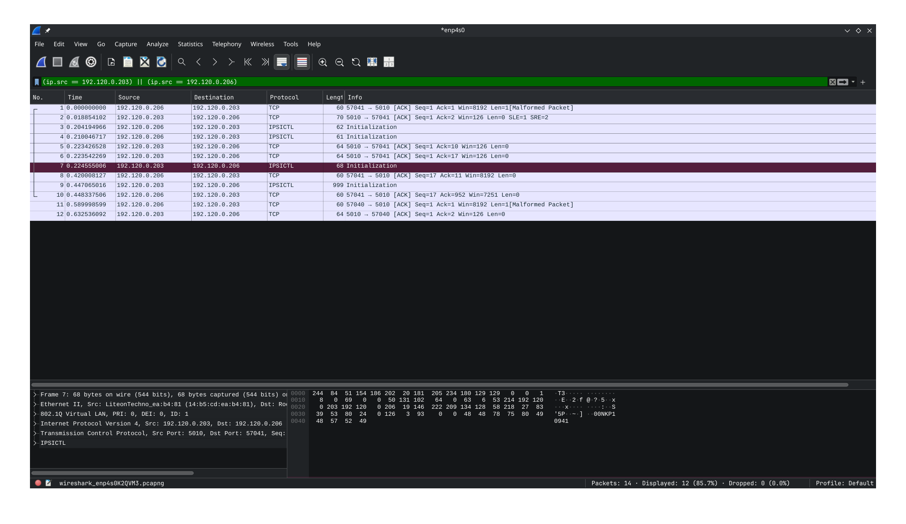
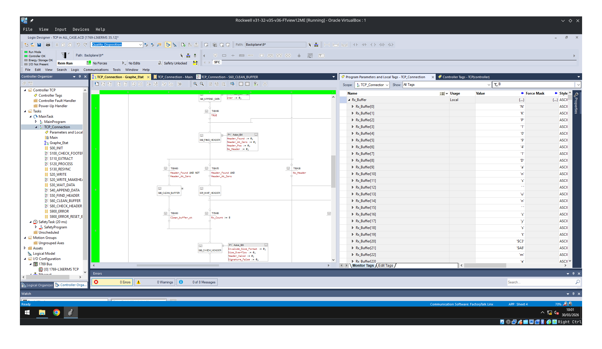

# Analyse du Protocole TCP

## Objectif
Valider le comportement du protocole de communication face à différentes stratégies d’envoi des données (header et payload), en observant :
- le comportement du réseau (Wireshark)
- le comportement côté automate Rockwell (buffer + parsing)

Le protocole repose sur :
- un **header fixe** : `NKP1XXXX`
  - `NKP1` : signature
  - `XXXX` : taille du payload (zéro-padding)
- suivi du **payload et du footer**

---

## Tests effectués

### 1. Header envoyé en deux parties

Le header est volontairement découpé en deux envois TCP distincts.

#### Observation Wireshark
Le header apparaît bien en **deux trames TCP distinctes**.

#### Observation côté Rockwell
- Les données sont **correctement reconstituées dans le buffer TCP**
- Le parsing fonctionne normalement
- Aucun impact fonctionnel

#### Conclusion
Le protocole est robuste à un **header fragmenté**.
→ Conforme au fonctionnement TCP (stream, pas message-based)

---

### 2. Header envoyé byte par byte

Chaque byte du header est envoyé individuellement.

#### Observation Wireshark
Contrairement à l’attente :
- Les bytes ne sont pas forcément visibles comme des trames séparées
- Le TCP **regroupe automatiquement les petits envois**

  

#### Explication technique
TCP est un protocole **orienté flux (stream)** :
- Il n’y a **aucune garantie de découpage des paquets**
- Le système réseau (stack TCP) peut :
  - fusionner les envois 
  - bufferiser avant envoi

#### Observation côté Rockwell
- Réception en un bloc
- Parsing fonctionnel

#### Conclusion
Envoyer byte par byte :
- N’a aucun intérêt en TCP
- Ne garantit pas une séparation réseau
- Le protocole reste fonctionnel grâce au parsing basé sur contenu

---

### 3. Header + Payload envoyés en une seule trame

Envoi classique : header + payload en une fois.

#### Observation Wireshark
- Une seule trame contenant l’ensemble des données

#### Observation côté Rockwell

Buffer brut :

Données décodées :

#### Conclusion
- Comportement attendu
- Parsing immédiat possible

---

### 4. Mauvais Header envoyés

Envoi d'un mauvais header 

#### Observation cote Rockwell

On detecte bien le mauvais header, on vas lire tout le buffer du socket pour assayer de le trouver, si rien, on retourne en idle

--- 

### 5. Taille trop grande

Envoi d'un payload trop importnat 

#### Observation cote Rockwell

On detecte bien que la size et trop grande comparer au buffer, on vient donc retourner en idle tout en vidant le buffer 

--- 

### 6. Mauvais format de size

Envoi d'un format non comforme pour la taille du payload

#### Observation cote Rockwell

On detecte l'erreur de format, resync puis retour en idle

--- 

### 7. Mauvais footer 

Envoi d'un mauvais footer 

#### Observation cote Rockwell

On detecte l'erreur de footer, resync puis idle

--- 

### 8. Bruit avant le Header

Envoie d'un header avec du bruit avant 

#### Observation Wireshark

#### Observation Rockwell

