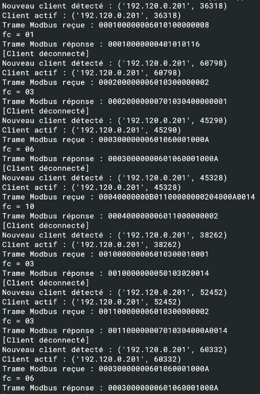
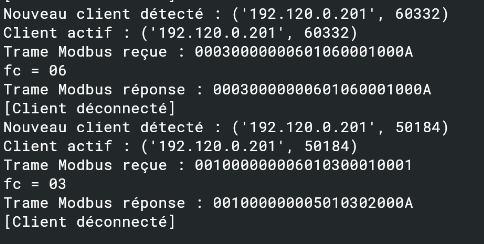

# Test du protocole Modbus TCP — Arduino

La carte Arduino implémente les fonctions Modbus suivantes :

- `01` → Read Coils  
- `03` → Read Holding Registers  
- `06` → Write Single Register  
- `10` → Write Multiple Registers  

---

## Analyse des échanges réseau

On observe ci-dessous un échange complet entre le client et la carte Arduino capturé avec Wireshark.

### Interprétation

- La requête contient :
  - un **MBAP Header** (Transaction ID, Protocol ID, Length, Unit ID)
  - un **PDU** (Function Code + Data)

- Exemple observé :
  - `01` → lecture de coils
  - la réponse contient :
    - `Byte Count`
    - les **bits packés (LSB first)**

Le serveur répond correctement avec une trame conforme au protocole Modbus TCP.

---

## Tests des fonctions implémentées

Des tests ont été réalisés sur l’ensemble des fonctions supportées :

### Résultats

- **FC01 (Read Coils)**  
  → Retour des états binaires correctement packés  

- **FC03 (Read Holding Registers)**  
  → Lecture des registres cohérente avec le mapping mémoire  

- **FC06 (Write Single Register)**  
  → La valeur est correctement écrite  
  → Réponse = **echo exact de la requête**  

- **FC10 (Write Multiple Registers)**  
  → Écriture multiple fonctionnelle  
  → Réponse = adresse + quantité écrite  

---

## Test lecture après écriture

 -> écrire une valeur puis la relire

### Séquence

1. **Write (FC06 ou FC10)**  
   -> écriture d’une valeur dans un registre  

2. **Read (FC03)**  
   -> lecture du même registre  

### Résultat

- La valeur lue correspond à la valeur écrite  
- La mise à jour mémoire est donc **effective côté serveur**
